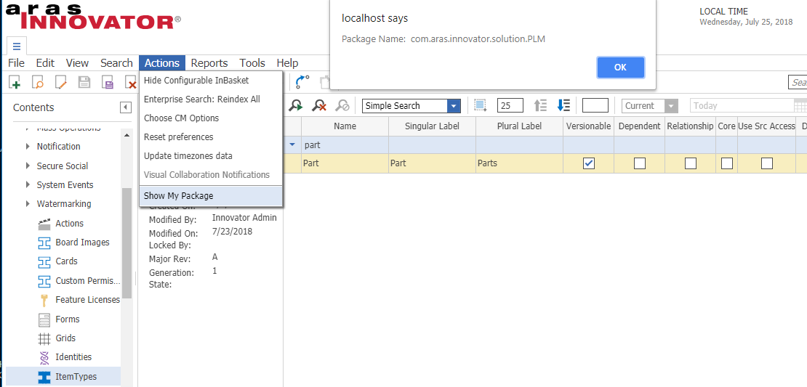

# Show Package of the Item Type

In an out-of-the-box instance of Aras Innovator, there is no any feature to check easily the package name in which the ItemType is placed.

This project contains simple method and action which will provide the package name when the corresponding Item Type is selected and action: Show My Package is called.

## Project Details

Screenshot:

#### Built Using:
Aras Innovator Version 11.0 SP12  Build: 6920

#### Versions Tested:
Aras Innovator Version 11.0 SP12  Build: 6920

#### Browsers Tested:
Internet Explorer 11, Chrome
#### Supported Aras Versions

## Installation

#### Important!
**Always back up your code tree and database before applying an import package or code tree patch!**

### Pre-requisites

1. Aras Innovator installed
2. Aras Package Import tool
3. **ShowMyPackage** import package

### Install Steps

**NOTE: This package makes modification in out od the box ItemType**

#### Database Installation
1. Backup your database and store the BAK file in a safe place.
2. Open up the Aras Package Import tool.
3. Enter your login credentials and click **Login**
  * _Note: You must login as root for the package import to succeed!_
4. Enter the package name in the TargetRelease field.
  * Optional: Enter a description in the Description field.
5. Enter the path to your local `..\ShowMyPackage\Import\imports.mf` file in the Manifest File field.
6. Select **VK.ShowPackages** in the Available for Import field.
7. Select Type = **Merge** and Mode = **Thorough Mode**.
8. Click **Import** in the top left corner.
9. Close the Aras Package Import tool.

You are now ready to try out Download Selected Files actions

### Usage
1. Login as admin
2. Select Item Type from TOC
3. Search for desired Item Type for which you want to see the package name
4. Select action **Show My Package** from action menu or right click context menu
5. You will see the popup with the package name in which the item type is placed. If the item is not yet added to any package you will get the same information.

## Contributing

1. Fork it!
2. Create your feature branch: `git checkout -b my-new-feature`
3. Commit your changes: `git commit -am 'Add some feature'`
4. Push to the branch: `git push origin my-new-feature`
5. Submit a pull request

## Credits

Created by : Vaibhav Kulkarni - vaibhavgk84@gmail.com
Created On : July 25 2018

